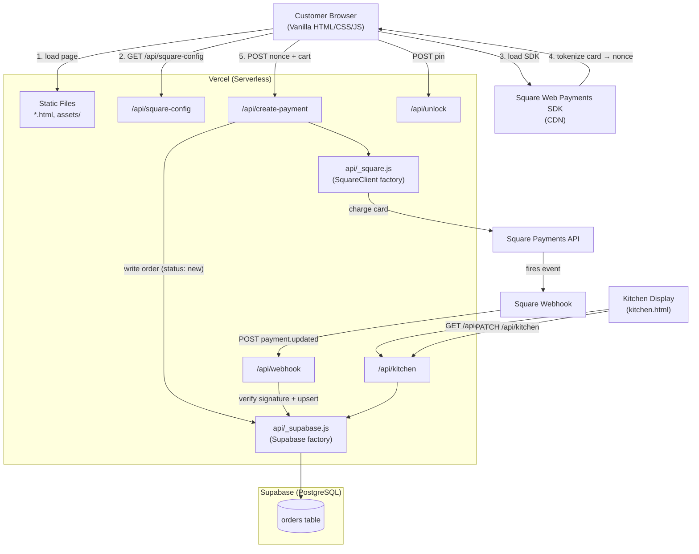
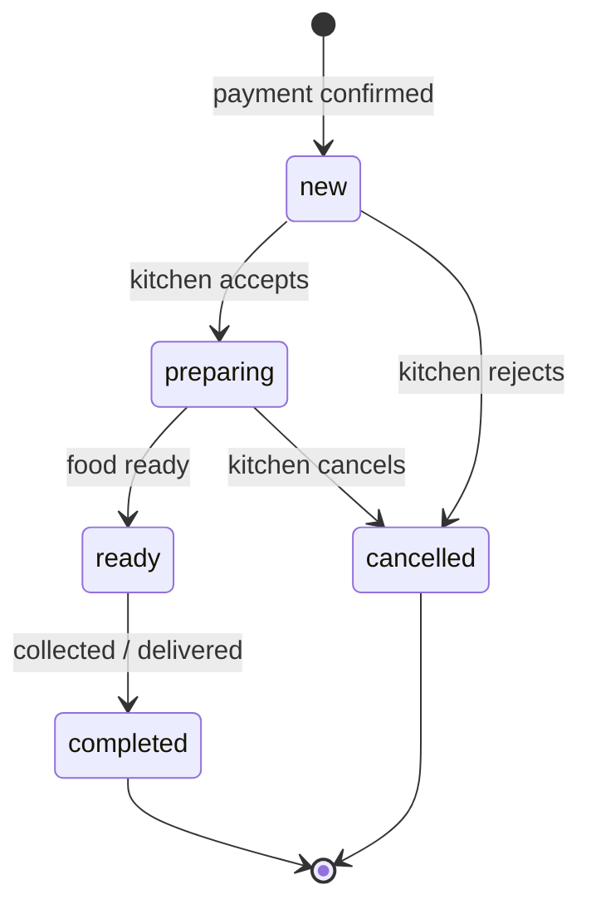
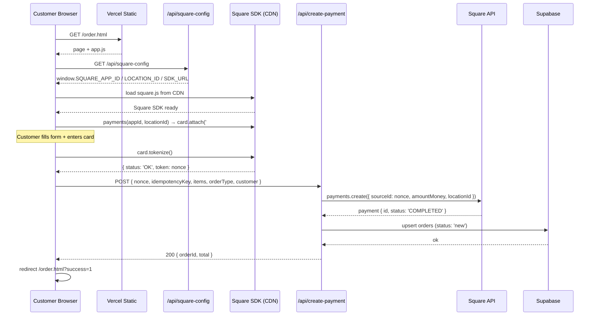
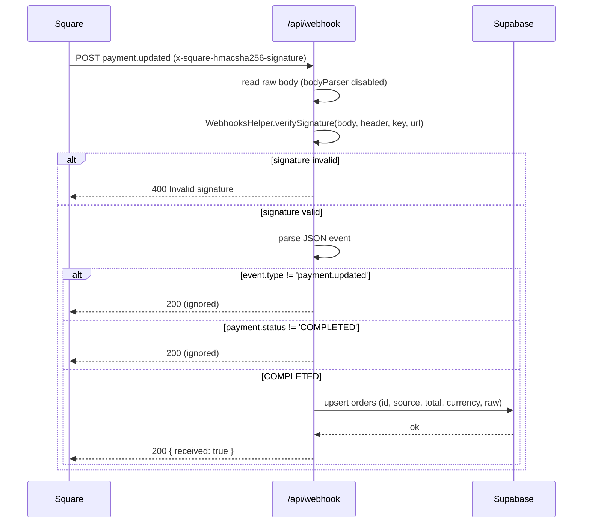
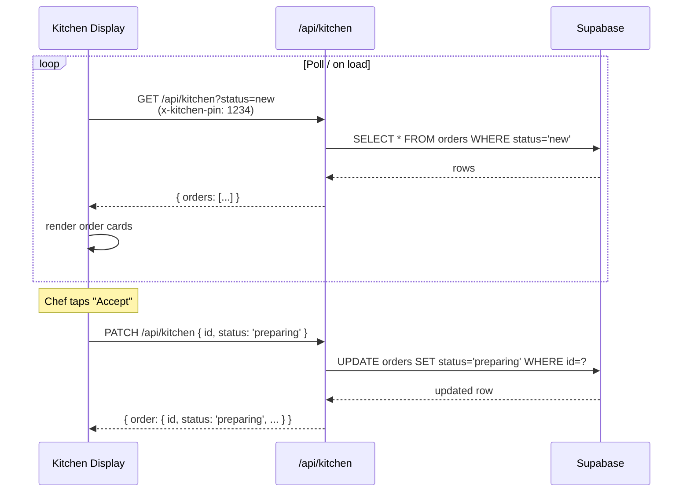
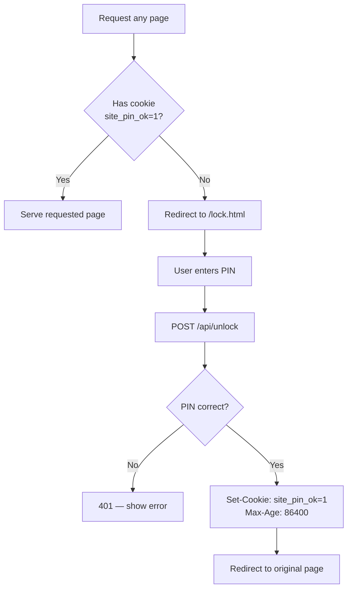

# Ruchira Indian Cuisine — Website & Ordering System

Online ordering, payment, and kitchen POS system for **Ruchira Indian Curry Point**.  
Built on Vercel (serverless) · Square Web Payments · Supabase PostgreSQL · Vanilla HTML/CSS/JS.

---

## Table of Contents

1. [Architecture Overview](#architecture-overview)
2. [Tech Stack](#tech-stack)
3. [Project Structure](#project-structure)
4. [Data Model](#data-model)
5. [Process Flows](#process-flows)
   - [Customer Checkout Flow](#customer-checkout-flow)
   - [Webhook Confirmation Flow](#webhook-confirmation-flow)
   - [Kitchen POS Flow](#kitchen-pos-flow)
   - [Site Access (PIN Lock) Flow](#site-access-pin-lock-flow)
6. [Environment Variables](#environment-variables)
7. [Local Development](#local-development)
8. [Deployment](#deployment)
9. [API Reference](#api-reference)
10. [Key Design Decisions](#key-design-decisions)

---

## Architecture Overview



---

## Tech Stack

| Layer | Technology |
|---|---|
| Hosting | [Vercel](https://vercel.com) — serverless Node.js functions + static assets |
| Frontend | Vanilla HTML5, CSS3, ES2020 JavaScript — no build step, no framework |
| Payments | [Square Web Payments SDK](https://developer.squareup.com/docs/web-payments/overview) (CDN) + Square Payments API (`square` npm v44) |
| Database | [Supabase](https://supabase.com) — PostgreSQL via `@supabase/supabase-js` v2 |
| Runtime | Node.js ≥18 (required by `square` v44) |

---

## Project Structure

```
ruchira-site/
├── index.html            # Homepage
├── menu.html             # Full menu browse
├── order.html            # Cart + Square card form + checkout
├── kitchen.html          # Kitchen POS display
├── about.html
├── contact.html
├── lock.html             # PIN gate (protects all pages)
├── middleware.js         # Vercel Edge middleware — enforces PIN cookie
├── vercel.json           # Build + routing config
├── package.json          # Dependencies: square, @supabase/supabase-js
├── supabase.sql          # Database schema
│
├── assets/
│   ├── css/styles.css
│   ├── js/app.js         # Menu render, cart state, Square SDK init, checkout
│   └── images/
│
└── api/
    ├── _supabase.js      # Shared Supabase client factory
    ├── _square.js        # Shared SquareClient factory
    ├── square-config.js  # Serves public Square keys as JS to browser
    ├── create-payment.js # Charge card + write order to Supabase
    ├── webhook.js        # Receive Square payment.updated events
    ├── kitchen.js        # Kitchen POS — GET orders, PATCH status
    └── unlock.js         # Validate site PIN, set cookie
```

---

## Data Model

### `orders` table (Supabase)

```sql
create table public.orders (
  id             text primary key,          -- Square payment.id
  created_at     timestamptz default now(),
  status         text not null default 'new',  -- new | preparing | ready | completed | cancelled | refunded
  source         text not null default 'square',
  customer       jsonb,                     -- { name, phone, address, timePref, notes, orderType }
  items          jsonb,                     -- [{ name, quantity, unit_amount, amount_total }]
  subtotal       integer,                   -- cents
  tax            integer,                   -- cents (5%)
  total          integer,                   -- cents
  currency       text,                      -- 'usd'
  payment_intent text,                      -- Square payment.id (same as id)
  raw            jsonb                      -- full Square payment object
);
```

### Order status lifecycle



---

## Process Flows

### Customer Checkout Flow



### Webhook Confirmation Flow



> **Note:** The webhook acts as an idempotent safety net. `create-payment.js` already writes the order synchronously at checkout time. The webhook catches edge cases where the network drops after Square charges the card but before the Supabase write completes.

### Kitchen POS Flow



### Site Access (PIN Lock) Flow



---

## Environment Variables

Set these in your Vercel project dashboard (**Settings → Environment Variables**) for Production and Preview environments.

### Square (required)

| Variable | Description | Example |
|---|---|---|
| `SQUARE_ACCESS_TOKEN` | Server-side secret token from Square Developer portal | `EAAAl...` |
| `SQUARE_APPLICATION_ID` | Public app ID (used by browser SDK) | `sandbox-sq0idb-...` |
| `SQUARE_LOCATION_ID` | Square location ID | `LXXXXXXXXXX` |
| `SQUARE_WEBHOOK_SIGNATURE_KEY` | Signature key from webhook subscription | `abc123...` |
| `SQUARE_WEBHOOK_URL` | Full webhook URL — **must exactly match** the URL registered in Square Developer portal | `https://ruchira.vercel.app/api/webhook` |
| `SQUARE_ENVIRONMENT` | `sandbox` or `production` | `production` |

### Supabase (required)

| Variable | Description |
|---|---|
| `SUPABASE_URL` | Your Supabase project URL |
| `SUPABASE_ANON_KEY` | Supabase anonymous/public key |

### App (required)

| Variable | Description |
|---|---|
| `SITE_PIN` | PIN code to unlock the site for customers |
| `KITCHEN_PIN` | PIN for kitchen staff to access `/api/kitchen` |

> **Security:** `SQUARE_ACCESS_TOKEN`, `SUPABASE_ANON_KEY`, `SITE_PIN`, and `KITCHEN_PIN` are server-side only. Only `SQUARE_APPLICATION_ID` and `SQUARE_LOCATION_ID` are served to the browser (via `/api/square-config`) — these are non-secret public keys per Square's documentation.

---

## Local Development

### Prerequisites

- Node.js 18+
- [Vercel CLI](https://vercel.com/docs/cli): `npm i -g vercel`
- Square Developer account (free at https://developer.squareup.com)
- Supabase project

### Setup

```bash
# 1. Clone and install
git clone <repo-url>
cd ruchira-site
npm install

# 2. Link to Vercel project (first time only)
vercel link

# 3. Pull environment variables from Vercel
vercel env pull .env.local

# 4. Start local dev server
vercel dev
```

The site will be available at `http://localhost:3000`.

> **Tip:** For local webhook testing, use [ngrok](https://ngrok.com/) or the [Square CLI webhook listener](https://developer.squareup.com/docs/webhooks/testing#local-testing) to forward Square events to your local machine. Update `SQUARE_WEBHOOK_URL` to your ngrok URL temporarily.

### Square Sandbox Test Cards

| Card Number | Result |
|---|---|
| `4111 1111 1111 1111` | Success |
| `4000 0000 0000 0002` | Card declined |
| CVV: `111` · Expiry: any future date · ZIP: `12345` | — |

---

## Deployment

### First Deploy

```bash
# Deploy to Vercel (production)
vercel --prod
```

### Subsequent Deploys

Push to the `main` branch — Vercel auto-deploys via Git integration.

### Checklist Before Going Live

- [ ] Switch `SQUARE_ENVIRONMENT` from `sandbox` to `production`
- [ ] Replace all sandbox Square credentials with production credentials from the Square Developer portal
- [ ] Update `SQUARE_WEBHOOK_URL` to production domain (e.g. `https://ruchira.vercel.app/api/webhook`)
- [ ] Register the production webhook subscription in Square Developer portal with event `payment.updated`
- [ ] Confirm `SQUARE_ACCESS_TOKEN` starts with `EAAA` (production tokens do not start with `EAAAl` sandbox prefix)
- [ ] Run `supabase.sql` against your production Supabase project to create the `orders` table
- [ ] Set a strong `SITE_PIN` and `KITCHEN_PIN` in production environment variables
- [ ] Remove any old `STRIPE_SECRET_KEY` / `STRIPE_WEBHOOK_SECRET` environment variables

### Database Setup (Supabase)

Run `supabase.sql` from the Supabase SQL editor (Dashboard → SQL Editor → New query):

```bash
# Or via Supabase CLI
supabase db push
```

---

## API Reference

| Method | Endpoint | Auth | Description |
|---|---|---|---|
| `GET` | `/api/square-config` | None | Returns public Square keys as JS (`window.SQUARE_APP_ID`, etc.) |
| `POST` | `/api/create-payment` | None | Tokenize card, charge Square, write order to Supabase |
| `POST` | `/api/webhook` | Square signature | Receive `payment.updated` events from Square |
| `GET` | `/api/kitchen` | `x-kitchen-pin` header | List orders (filter by `?status=new`) |
| `PATCH` | `/api/kitchen` | `x-kitchen-pin` header | Update order status `{ id, status }` |
| `POST` | `/api/unlock` | None | Validate site PIN, set `site_pin_ok` cookie |

### `POST /api/create-payment` — Request Body

```json
{
  "nonce": "cnon:card-nonce-ok",
  "idempotencyKey": "550e8400-e29b-41d4-a716-446655440000",
  "items": [{ "id": "butter-chicken", "qty": 2 }],
  "orderType": "pickup",
  "customer": {
    "name": "Priya Sharma",
    "phone": "+91 98765 43210",
    "address": "",
    "timePref": "Today 8:00 PM",
    "notes": "Extra spicy"
  }
}
```

### `POST /api/create-payment` — Responses

| Status | Body | Meaning |
|---|---|---|
| `200` | `{ orderId, total }` | Payment charged, order written |
| `400` | `{ error }` | Validation error (missing fields, unpriced item, empty cart) |
| `402` | `{ error }` | Card declined |
| `500` | `{ error }` | Square or Supabase misconfiguration |

---

## Key Design Decisions

**Synchronous order creation** — Unlike Stripe's redirect model, Square's API is synchronous: `create-payment.js` charges the card and writes the Supabase order in a single HTTP request. The webhook (`webhook.js`) is an idempotent fallback for network failures after payment.

**No build step** — The frontend is plain HTML/CSS/JS served as static files. The Square SDK is loaded from CDN at runtime, gated on config from `/api/square-config`. This keeps the site deployable with zero toolchain.

**PIN-gated site** — All pages require a `site_pin_ok` cookie set by `/api/unlock`. The Vercel Edge middleware (`middleware.js`) enforces this before any page is served.

**BigInt for money** — Square's v44 SDK requires `amountMoney.amount` to be a JavaScript `BigInt`, not a regular integer. All cent values are cast with `BigInt(totalCents)` in `create-payment.js`.

**Webhook URL must exactly match** — `SQUARE_WEBHOOK_URL` must be the exact URL string registered in the Square Developer portal. Even a trailing slash difference will cause `WebhooksHelper.verifySignature` to return `false`.

**Kitchen POS is pull-based** — `api/kitchen.js` is a REST endpoint; the kitchen display polls it. For real-time updates without polling, connect the kitchen frontend directly to Supabase Realtime (`supabase.channel('orders').on('postgres_changes', ...)`) — no backend change is needed.
